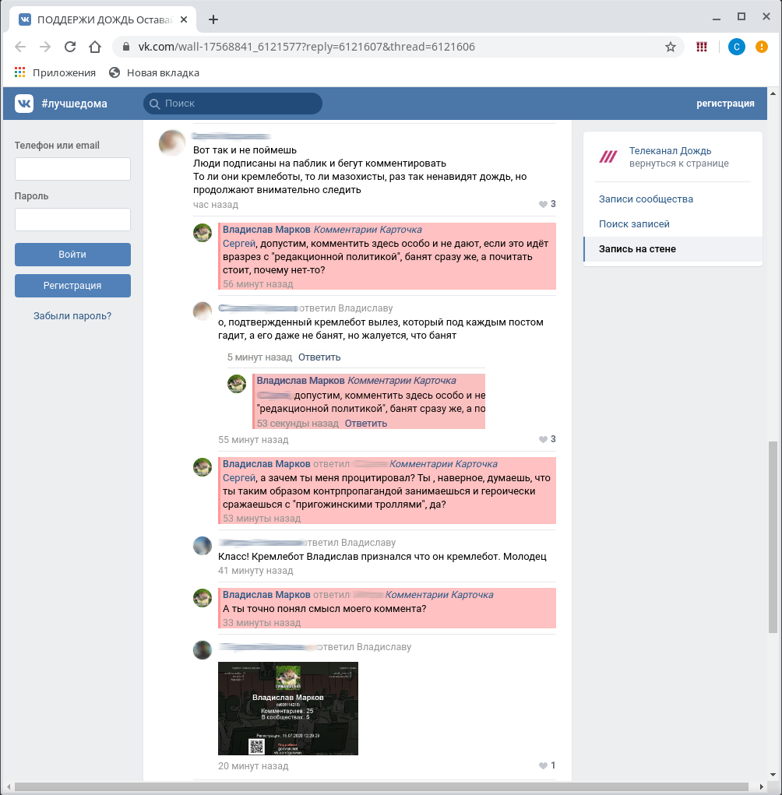

# Антикремлебот — Подсветка ботов

Расширение, подсвечивающее аккаунты ботов ВКонтакте.  
База данных для ВКонтакте взята с проекта [gosvon.net](https://gosvon.net).  
База данных для YouTube взята с проекта [Наблюдатель](https://t.me/observers_chat).

Пример работы плагина на сайте ВКонтакте (комментарии ботов подсвечены красным):

Пример работы плагина на сайте YouTube:

!

Создано при поддержке движения [Гражданское Общество](https://civsoc.net/).
 
Репозиторий: https://github.com/civsocit/gosvon
